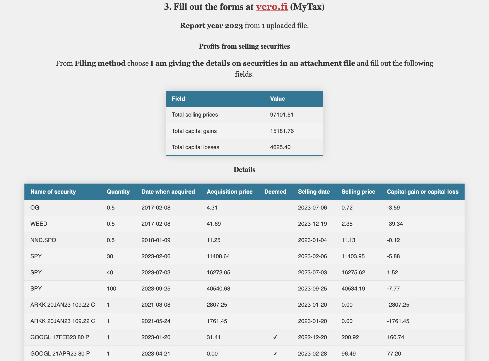

# ibkr-report-parser

[](https://pypi.org/project/ibkr-report-parser/)
[](https://pypi.org/project/ibkr-report-parser/)
[](https://github.com/oittaa/ibkr-report-parser/actions/workflows/main.yml)
[](https://codecov.io/gh/oittaa/ibkr-report-parser)
[](https://github.com/psf/black)

Interactive Brokers (IBKR) Report Parser for MyTax (vero.fi) - not affiliated with either service

## Example



## How to run locally

### Option 1: pip
```shell
pip install ibkr-report-parser
ibkr-report-parser
```

### Option 2: Docker
````shell
docker pull ghcr.io/oittaa/ibkr-report-parser
docker run --rm -d -p 8080:8080 --name ibkr-report-parser ghcr.io/oittaa/ibkr-report-parser
````

### Use the app

Browse to http://127.0.0.1:8080/

The web UI is available in **English** and **Finnish**. The language is detected from the browser (`Accept-Language`) and defaults to English; you can switch with the **EN | FI** control (preference is stored in a cookie).

## Environment variables

* `TITLE` The title of the website. Default `IBKR Report Parser`
* `CURRENCY` The currency used in the report output. Default `EUR`
* `USE_DEEMED_ACQUISITION_COST` Whether to use the [deemed acquisition cost][selling shares], if it benefits you. Default `TRUE`
* `STORAGE_TYPE` The storage to save the fetched daily Euro exchange rates, if set to anything other than `DISABLED`. Currently supported types are `LOCAL`, `AWS`, and `GCP`. Default `DISABLED`
* `STORAGE_DIR` The directory used when `STORAGE_TYPE` is set to `LOCAL`. Default `.ibkr_storage`
* `BUCKET_ID` The storage bucket used when `STORAGE_TYPE` is set to `AWS` or `GCP`. Default `""`

### Testing and debugging
* `DEBUG` Flask debug. Default `FALSE`
* `LOGGING_LEVEL` Python logging level. Default `INFO`
* `EXCHANGE_RATES_URL` URL for the Euro exchange rates from European Central Bank. Default `https://www.ecb.europa.eu/stats/eurofxref/eurofxref-hist.zip`

## How to build yourself

### Python
```shell
git clone https://github.com/oittaa/ibkr-report-parser.git
cd ibkr-report-parser
pip install .
ibkr-report-parser
```

### Docker
```shell
git clone https://github.com/oittaa/ibkr-report-parser.git
cd ibkr-report-parser
docker build -t ibkr-report-parser:latest .
docker run --rm -d -p 8080:8080 --name ibkr-report-parser ibkr-report-parser
```

## Multiple years and options

You can upload **several CSV files** (or one multi-year custom statement). The app:

1. Merges all trades so option premiums from earlier years can adjust stock lots sold later.
2. Reports only disposals from the **latest calendar year** present in the data (for MyTax). The year of each row is the later of acquisition and disposal dates (for shorts that is the cover year).

This matters for **short puts that get assigned**: the premium is not taxed on the option; it reduces the acquisition cost of the shares. A later-year IBKR statement alone does **not** include that premium—you need the assignment year in the upload as well.

Option exercise/assignment (IBKR codes `A` / `Ex`) is folded into the stock leg:

| Position | Event | Effect on stock |
|----------|--------|-----------------|
| Short call | Assigned | Premium **increases** disposal price (*luovutushinta*) |
| Long call | Exercised | Premium **increases** acquisition cost (*hankintahinta*) |
| Short put | Assigned | Premium **decreases** acquisition cost (*hankintahinta*) |
| Long put | Exercised | Premium **decreases** disposal price (*luovutushinta*) |

Expired options and cash closes are still reported as option disposals.

## MyTax field names (form 9A)

UI labels and the Python API follow [Verohallinto form 9A][form 9a] terminology. The UI shows one language at a time (EN or FI); the table below lists the official wording used:

| Report / API | Form 9A (English) | Finnish |
|--------------|-------------------|---------|
| `acquired_on` | Date when acquired | Hankintapäivä |
| `acquisition_cost` | Acquisition price | Hankintahinta |
| `disposed_on` | Selling date | Luovutuspäivä |
| `proceeds` | Selling price | Luovutushinta |
| `realized` | Capital gain / capital loss | Luovutusvoitto / luovutustappio |
| `used_deemed_acquisition_cost` | Deemed acquisition cost | Hankintameno-olettama |
| Totals: `proceeds` / `gains` / `losses` | Total selling prices / capital gains / capital losses | Luovutushinnat / -voitot / -tappiot yhteensä |

## Python API

```python
from ibkr_report import Report

FILE_1 = "tests/test-data/data_single_account.csv"
FILE_2 = "tests/test-data/data_multi_account.csv"

with open(FILE_1, "rb") as file:
    report = Report(file=file, report_currency="EUR", use_deemed_acquisition_cost=True)

with open(FILE_2, "rb") as file:
    report.add_trades(file=file)

print(f"Report year: {report.report_year} ({report.file_count} file(s))")
# Totals → form 9A: Luovutushinnat / Luovutusvoitot / Luovutustappiot yhteensä
print(f"Total disposal prices (luovutushinnat): {report.proceeds}")
print(f"Total capital gains (luovutusvoitot): {report.gains}")
print(f"Total capital losses (luovutustappiot): {report.losses}")

for item in report.disposals:
    # Hankintapäivä / hankintahinta / luovutuspäivä / luovutushinta / voitto tai tappio
    print(
        f"{item.symbol=}, {item.quantity=}, "
        f"hankintapäivä={item.acquired_on}, hankintahinta={item.acquisition_cost}, "
        f"luovutuspäivä={item.disposed_on}, luovutushinta={item.proceeds}, "
        f"realized={item.realized}"
    )

```

```python
from ibkr_report import ExchangeRates, StorageType

rates = ExchangeRates(storage_type=StorageType.LOCAL, storage_dir="/tmp/my_storage")
print(rates.get_rate("EUR", "USD", "2020-06-20"))
print(rates.get_rate("GBP", "SEK", "2015-12-31"))
```

[selling shares]: https://www.vero.fi/en/individuals/property/investments/selling-shares/
[form 9a]: https://www.vero.fi/tietoa-verohallinnosta/yhteystiedot-ja-asiointi/lomakkeet/tayttoohjeet/9a-arvopapereiden-luovutusvoitot-ja--tappiot-t%C3%A4ytt%C3%B6ohje/
